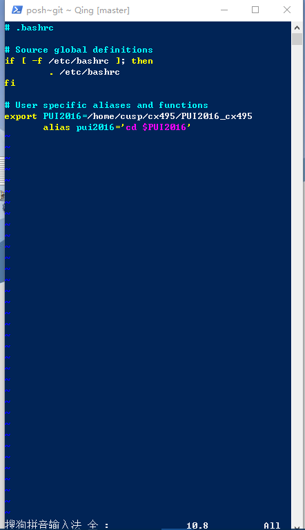
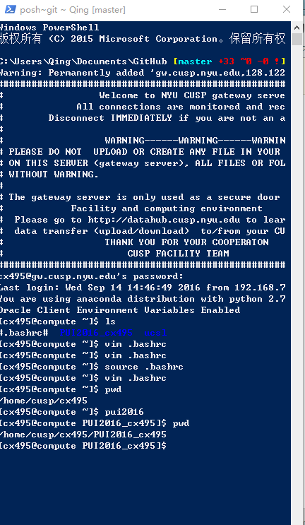

I did my assignment2 by follwing the instructions https://github.com/fedhere/PUI2016_fb55/blob/master/HW1_fb55/README.md, using git shall to write command lines.
I also asked Le Xu for help when setting an evrionmental variable.
Also, I did not have a  bashrc file at first so i touched it at the beginning.
Furthermore, at the step 6 i have problem connect local to my github. I am still working on it.My computer does not work so well. I will get a Macbook as soon as possible. 
